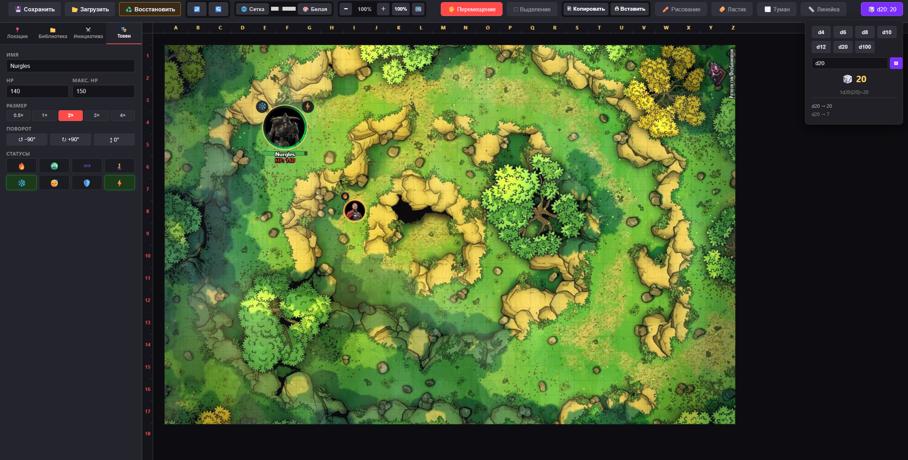

# 🎲 DM's Tactical Board V3

Виртуальный игровой стол (VTT) для настольных ролевых игр (D&D 5e и совместимые системы), упакованный в **один HTML-файл**. Никаких серверов, установок и регистраций — открыл в браузере и играешь.

Сделан для DM, который выводит изображение на проектор/телевизор и водит сессию вживую: всё управление у мастера, все видят один и тот же экран.


---

## ✨ Возможности

### 🗺️ Карта и навигация
- Рендер на `<canvas>` — плавный зум и панорамирование без рывков
- Зум колесиком мыши с приближением к точке курсора
- Тактическая сетка с привязкой к клеткам (1 клетка = 5 футов, как в правилах D&D) — **квадратная или гексагональная** (выбирается для каждой локации; на гексах токены встают в центр гекса, а линейка считает гексы)
- Переключаемый цвет и прозрачность сетки
- Полноэкранный режим (для показа на проектор/ТВ)
- Линейка измерения — показывает расстояние одновременно в футах и клетках

### 🧙 Токены
- Drag & drop изображений прямо на карту
- Изменение размера (0.5× / 1× / 2× / 3× / 4×) и поворота
- Имя, текущий и максимальный HP
- **HP-бар** под токеном — зелёный / жёлтый / красный по проценту здоровья
- Система статус-эффектов с Unicode-иконками (🔥 🤢 🕶️ 🧎 ❄️ 😴 🛡️ ⚡), отображаются бейджами по дуге **снаружи** токена, не перекрывая картинку
- Привязка к сетке при перетаскивании (Snapping)
- Панель свойств токена — отдельная вкладка сайдбара, открывается двойным кликом
- **Длительность состояний в раундах** — задаётся в панели токена; счётчик тикает в начале хода существа в трекере инициативы, по окончании статус снимается сам с уведомлением

### 📜 Карточка монстра
- В панели токена: **КД**, **скорость** и список **атак** (название, бонус попадания, формула урона)
- Кнопка 🎲 у атаки бросает d20 + бонус и урон; на натуральной 20 кубики урона удваиваются (крит)
- Результат виден в панели и в истории кубиков; в окно игроков карточка не передаётся

### 💔 Урон и лечение группе
- Кнопка **«❤️ Урон/лечение»**: введи число и нажми «Урон» или «Лечение» — HP меняется у всех выделенных токенов сразу (или у токена, открытого в панели). `Enter` — урон, `Shift+Enter` — лечение
- Лечение не поднимает HP выше максимума
- На 0 HP токен помечается мёртвым (затемнение и красный крест); в контекстном меню есть «💀 Мёртв / жив»
- «Следующий ход» пропускает мёртвых, а в трекере они зачёркнуты

### ⬚ Выделение и буфер обмена
- Режим рамочного выделения (drag по пустому месту)
- Групповое перетаскивание нескольких токенов
- Копировать / Вставить (кнопки или `Ctrl+C` / `Ctrl+V`)
- Каскадное смещение при повторной вставке — жми `Ctrl+V` сколько угодно раз, копии не накладываются друг на друга
- `Delete` — удаление всех выделенных токенов одним нажатием

### 🌫️ Туман войны — три режима нанесения
- **🖌️ Кисть** — свободное рисование, без накопления прозрачности на стыках мазков
- **📐 Полигон** — кликами по точкам, замыкание двойным кликом или возвратом к первой вершине, отмена по `Esc`
- **▭ Прямоугольник** — быстрое перекрытие комнаты одним движением
- Правый клик по любой зоне тумана (независимо от типа) — скрыть/показать или удалить

### ⚔️ Боевой трекер инициативы
- Импорт всех токенов локации одним кликом или добавление вручную
- Сортировка по значению инициативы
- Кнопка «Следующий ход» с подсветкой активного токена прямо на карте и счётчиком раундов
- Редактирование HP прямо в трекере (`+1` `+5` `−1` `−5` или ручной ввод), синхронизируется с токеном на карте

### 🎲 Кубики
- Парсер формул D&D: `2d6+3`, `d20`, `4d6kh3` (3 лучших из 4), `4d6kl2` и любые комбинации с модификаторами
- Лог последних бросков с детализацией каждого кубика

### 📍 Пинги
- `Shift + клик` (на тачскрине — долгое нажатие) по карте — анимированный цветной пинг, чтобы привлечь внимание игроков к точке на экране

### 📁 Локации и библиотека
- Несколько локаций в одном приключении, переключение без потери состояния
- Библиотека с папками для хранения токенов NPC/предметов, drag & drop прямо на карту

### 💾 Сохранение
- Экспорт/импорт всего приключения в `.json`
- **Автосохранение в IndexedDB** — через пару секунд после любого изменения и при закрытии вкладки; при следующем запуске предлагается «♻️ Восстановить». Если сохранить не удалось, в шапке появляется предупреждение
- Импорт `.json` проверяется и нормализуется: битый файл не стирает текущую сессию
- Заметки мастера сохраняются вместе с приключением
- Автоматическое сжатие загружаемых изображений через canvas (карты до 1600px, токены до 512px) — файл не раздувается

### 🔺 Шаблоны заклинаний (AoE)
- Конус, сфера, линия (5 фт), куб — размер в футах, точка и направление задаются перетаскиванием
- Масштаб берётся из настройки «Размер клетки» локации (вкладка «Локации»)

### 🧱 Стены, двери и освещение
- Режим **«🧱 Стены»** (`W`): клики ставят точки стены, двойной клик или `Enter` — закончить; при включённой квадратной сетке точки липнут к углам клеток
- ПКМ по стене — превратить в дверь, открыть/закрыть, удалить
- **Темнота** включается для каждой локации отдельно; источник света — поле «Свет (фт)» у токена (факел 40, фонарь 60)
- Свет рассчитывается по линии видимости: стены и закрытые двери его перекрывают, открытая дверь пропускает
- Игроки видят только освещённое (полная темнота), мастер — полупрозрачную темноту (регулируется)
- **Персонажи игроков и тёмное зрение**: в панели токена — «Персонаж игрока» и «Тёмное зрение, фт»; персонаж с тёмным зрением видит в темноте приглушённо, с учётом стен
- **👁 Обзор персонажей** (для каждой локации): игроки видят только то, что на линии видимости хотя бы одного персонажа — монстры за углом скрыты; мастер видит эту маску полупрозрачной

### 🖥️ Окно для игроков
- Кнопка **«🖥️ Игрокам»** открывает второе окно с картой: без панелей, линеек, HP и скрытых зон тумана, карта сама вписывается в экран; пинги синхронизируются
- Работает без сервера (BroadcastChannel) — перетащи окно на проектор/ТВ

### 📱 Планшеты и тачскрины
- Управление через Pointer Events: перетаскивание токенов, рисование, туман; два пальца — масштаб и панорама, долгое нажатие — пинг
- Карту и токены можно загружать кнопками («🖼️ Карта», «＋» у папки библиотеки) — drag & drop не обязателен

### ⌨️ Горячие клавиши
| Клавиша | Действие |
|---|---|
| `V` | Режим выделения |
| `H` | Режим перемещения |
| `F` | Режим тумана войны |
| `R` | Линейка |
| `D` | Рисование |
| `T` | Шаблоны заклинаний |
| `W` | Стены и освещение |
| `Пробел` (удержание) | Временное панорамирование |
| `Ctrl + Z` / `Ctrl + Y` | Отмена / повтор (история 50+ шагов) |
| `Ctrl + C` / `Ctrl + V` | Копировать / вставить выделенные токены |
| `Delete` | Удалить выделенные токены |
| `Esc` | Сброс текущего инструмента (линейка, полигон тумана, выделение) |

---

## 🚀 Быстрый старт

Никакой установки не требуется.

```bash
git clone https://github.com/AndriiLievientsov/DM-s-Tactical-Board.git
cd DM-s-Tactical-Board
```

Открой `index.html` в любом современном браузере (Chrome, Edge, Firefox). Всё.

Для использования на сессии — выведи окно браузера на второй монитор/проектор, и веди игру.

---

## 🛠️ Технологии

- **Vanilla JavaScript** — без фреймворков и сборщиков
- **HTML5 Canvas** — весь игровой рендер (сетка, токены, туман, линейка, пинги)
- **CSS3** — интерфейс
- **Zero dependencies** — ни одной внешней библиотеки, ни одного CDN-запроса

Один `.html`-файл — это и есть всё приложение. Можно положить на флешку, отправить в мессенджере, открыть offline.

---

## 📂 Структура данных приключения (`.json`)

```json
{
  "version": 3,
  "notes": "Заметки мастера",
  "locations": [
    {
      "id": 1,
      "name": "Стартовая локация",
      "bgData": "data:image/jpeg;base64,...",
      "tokens": [
        { "id": 123, "src": "...", "x": 100, "y": 150, "radius": 25,
          "name": "Гоблин", "hp": 7, "maxHp": 7, "rotation": 0, "statuses": ["🔥"] }
      ],
      "drawings": [],
      "fog": [
        { "id": 456, "type": "polygon", "hidden": false, "color": "#000000",
          "opacity": 0.92, "points": [{"x":0,"y":0}, "..."] }
      ]
    }
  ],
  "currentLocationId": 1,
  "library": [
    { "id": 102, "name": "Токены NPC", "type": "folder", "collapsed": false, "children": [] }
  ]
}
```

---

## 🗺️ Roadmap / возможные доработки

- [ ] Слой освещения / затемнение карты для ночных сцен

---

## 📜 Лицензия

Свободно для личного и некоммерческого использования. Если используешь и дорабатываешь — будет приятно увидеть ссылку на оригинал.

---

*Сделано DM-ами для DM-ов. Никакой подписки, никакой регистрации, никакого интернета на сессии не нужно.*
